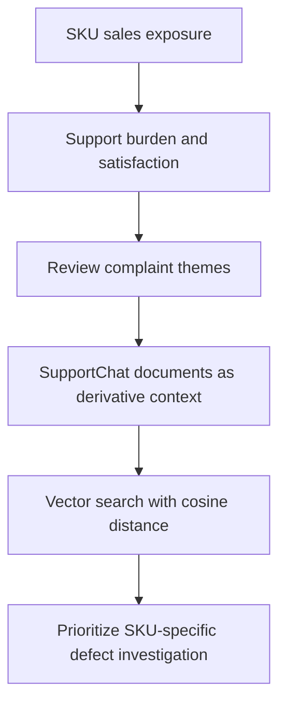

# Data Analyst Executive Brief

## 1. Executive conclusion

SKU ZCPTM-SS-M-BW, Premium Short Sleeve Men's Top, shows a specific smart-fabric wash/connectivity durability problem. The evidence is strongest at the SKU level and should not be generalized to the entire Premium category.

## 2. Why this SKU should be prioritized

This SKU combines meaningful sales exposure, a material support burden, and a repeated complaint pattern centered on smart-fabric failure after washing. Two other SKUs had higher raw ticket rates, but each had only two tickets and much smaller evidence sets, so they are weaker candidates for a product-quality priority decision.

## 3. Sales exposure

At the SKU level, ZCPTM-SS-M-BW had:
- 228 units sold
- $19,825.05 in revenue
- 9 support tickets linked to the SKU

That makes the issue operationally relevant even though its raw ticket rate (about 3.95% of units sold) was lower than two other SKUs with only two tickets each.

## 4. Support burden and satisfaction

The SKU had 9 distinct support tickets and an average satisfaction score of 1.67/5 across those tickets. The complaint burden is therefore both broad enough to matter and low enough in satisfaction to indicate friction.

## 5. Recurring complaint themes

The recurring themes are concentrated around the smart-fabric experience failing after washing:
- DocId 39: “smart fabric stopped connecting after one wash”
- DocId 40: “Connectivity fails after washing”
- DocId 41: “App keeps losing the sensor after laundry”
- DocId 42: “broken smart features”

These four quoted examples are independent review evidence. In addition, 8 SupportChat documents existed, but they were derivative representations of their underlying chat/ticket records and were therefore not counted as additional independent complaints.

## 6. Vector-search evidence

The vector search used cosine distance, where lower values indicate a closer semantic match. The anchor review for DocId 39 produced nearby documents centered on wash-related loss of connectivity, failed app pairing, and broken smart features. A comparison document from another Premium product produced less coherent neighbors and a less specific theme.

## 7. Recommended business action

Prioritize a targeted investigation of the smart-fabric component and wash durability path for ZCPTM-SS-M-BW, including the sensor/threading/app-pairing pathway and any care-label or post-wash guidance. Do not treat this as evidence that the entire Premium category has the same defect.

## 8. Confidence and limitations

Confidence is moderate-to-strong for a specific SKU-level defect, but it should be tempered by dataset structure. The target SKU had unusually heavy document seeding relative to other SKUs (14 total documents, including 6 review documents and 8 support-chat documents), which can overweight curated examples. The support-chat set is also derivative rather than independent. The conclusion is strongest as a narrowed claim: this SKU shows a recurring wash/connectivity durability problem, not a broad category-wide failure.

## 9. Investigation workflow diagram

